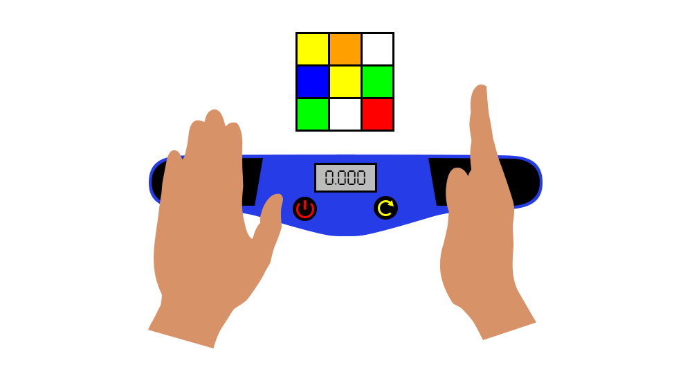
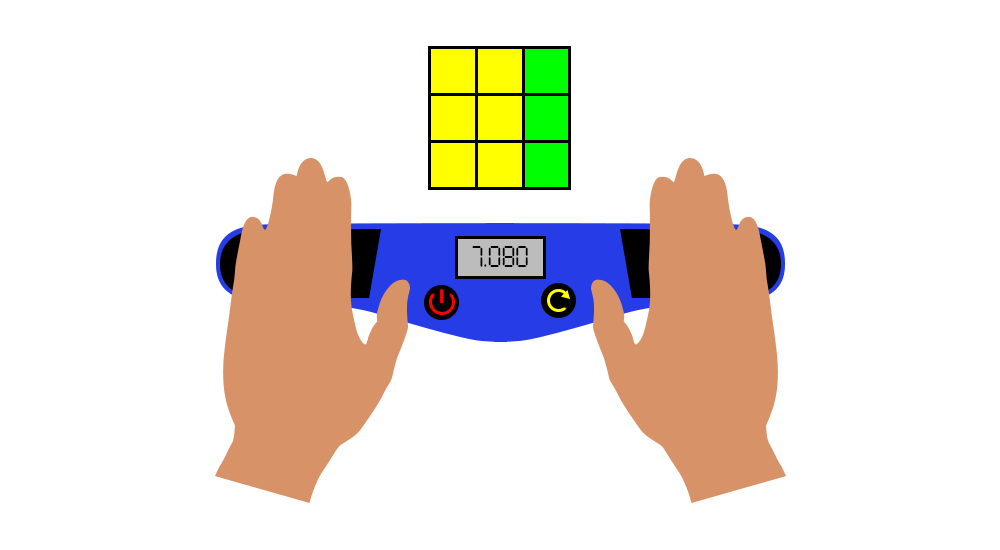

# Judging Tutorial for Newcomers

This document is intended for those who have not been a judge before, and will highlight some of the key regulations to follow during the judging process. The procedure described is intended for regular speedsolving events. For blindfolded events there are a few key differences not highlighted in this document.

## Equipment

This is the main equipment and tools required to proceed with a speedsolving attempt:

**Stackmat timer**: This is the official device for measuring times at a WCA competition. The image below is the latest version of the timer, previous versions of the timer are still accepted to be used in competitions.

{.centered}

**Stopwatch**: This is used for measuring the inspection time. Stopwatches are also used to measure time for attempts over 10 minutes. **Note: Not to be confused with a stackmat timer.**

## Judging Procedure

1. Place the scrambled puzzle on the mat and keep it covered before the start of every attempt.
2. Reset both the stackmat timer and stopwatch.
3. The competitor has one minute to get ready when asked.
4. Once the competitor is ready, uncover the puzzle and start the stopwatch simultaneously to time the inspection. This starts the attempt.
5. After 8 seconds of inspection have elapsed you must call “8 seconds”. After 12 seconds of inspection have elapsed, you must call “12 seconds”.
6. During the inspection phase, the competitor must not make any move to the puzzle, except to correct minor misalignments.
7. The competitor starts the solve by placing their fingers on the sensors, waiting for the green light to turn on and then removing their hands from the timer.
8. Stop the stopwatch as soon as the competitor starts their solve.
9. The competitor stops the timer once they have solved the puzzle to stop the attempt. Inspect the puzzle without touching it (except for the Clock event) and call “OKAY”, “PENALTY”, or “DNF”.
10. A final result (along with penalties, if applicable) is recorded on the scorecard before both the judge and the competitor sign the attempt to verify that the result is correct and accepted.

::::: {.page-break-before}
:::::

## Penalties

**+2** is a penalty where 2 seconds are added to the final result of the attempt. **Did Not Finish** (DNF) is a penalty that results in a disqualification of the attempt. If you are not sure what should be done in an incident, you should ask the WCA Delegate of the competition for advice.

Here are some common incidents that can result in +2 or DNF:

{.centered}

**+2** is given when the competitor exceeds 15 seconds of inspection time and starts the timer before 17 seconds.

**DNF** is given when the competitor fails to start the timer within 17 seconds of inspection time.

{.centered}

**+2** is given when the competitor touches the puzzle while starting the timer.

**+2** is given when the competitor stops the timer without fully releasing the puzzle.

**+2** is given when the competitor touches the puzzle before the judge has inspected the solved state.

::::: {.page-break-before}
:::::

{.centered}

**+2** is given when the competitor fails to start the timer with their palms facing down.

**+2** is given when the competitor fails to stop the timer with their palms facing down.

{.centered}

**+2** is given if the puzzle is one move away from the solved state at the end of the attempt.

Note: 180° turns (R2, U2, etc.) are considered one move.

::::: {.page-break-before}
:::::

::::: {.box .attention}
#### This shows what kind of misalignments result in a +2 penalty:

{.centered}
:::::

Other incidents that can result in a penalty:

-   While inspecting or solving the puzzle, the competitor must not communicate with anyone other than the judge or the WCA Delegate of the competition. (DNF)
-   While inspecting or solving the puzzle, the competitor must not receive assistance from anyone or any object other than the surface. (DNF)
-   While inspecting or solving the puzzle, the competitor must not interact with or touch any kind of recording device or electronics. (DNF)

## Recording Results

If any penalty was given, you should always write the original time, the penalties given and the final time. Penalties are also written before or after the original time depending on whether they happened before or after the attempt. For example, if a competitor finishes an attempt with a time of 17.65 and receives a +2 for not properly starting the timer, the final result should written as `2+17.65=19.65`, since the penalty occurred before the attempt started.
